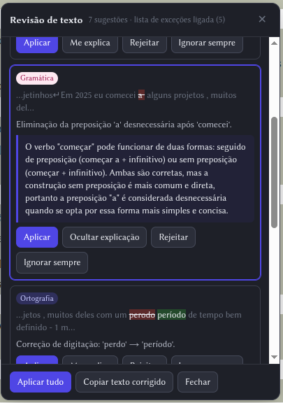
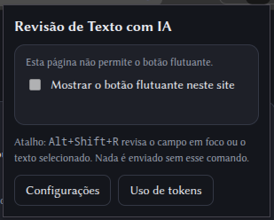

# Revisão de Texto com IA

Extensão para Chrome/Brave (Manifest V3, JavaScript puro, sem bundler) que revisa **ortografia, gramática e clareza**
de qualquer texto em qualquer página, em **português do Brasil e inglês**, usando o Claude. Uso pessoal.

> **Status:** em desenvolvimento. A lógica pura tem testes automáticos; a interface (painel, botão flutuante, aplicação
> das correções) ainda depende do roteiro de teste manual abaixo.

## Recursos

- **Revisão sob comando:** só acontece quando você aciona (botão flutuante, atalho ou menu de contexto). Nada é lido nem
  enviado por conta própria.
- **Dois motores:** sua **assinatura Claude** via Claude Code local (padrão, sem crédito de API) ou a **API da
  Anthropic** (chave e crédito próprios). Modelo configurável (Haiku 4.5 por padrão).
- **Painel de sugestões** com diff, categoria e explicação curta. Aplicar, rejeitar, "ignorar sempre", "aplicar tudo".
- **Trecho mínimo:** cada sugestão é reduzida ao que realmente muda (não a frase inteira), na marcação e na aplicação.
- **Destaque na página:** a sugestão atual é marcada em amarelo no texto do site, e a tela rola até ela.
- **Me explica:** a regra por trás de uma correção, sob demanda, dentro do card.
- **Lista de exceções:** palavras e expressões que a revisão deve ignorar (útil para quem não adota o Acordo
  Ortográfico), com liga/desliga.
- **Instruções de estilo:** regras suas que se somam ao prompt base.
- **Métricas de tokens:** gráfico de tokens por dia, semana, mês e ano, sem guardar nenhum texto.

## Capturas de tela

<table>
  <tr>
    <td align="center" valign="top">
      
      <br>
      <sub><b>Painel de sugestões:</b> diff do trecho que muda, categoria, explicação curta e a explicação detalhada aberta pelo <b>Me explica</b>.</sub>
    </td>
    <td align="center" valign="top">
      
      <br>
      <sub><b>Popup do ícone:</b> ativa o botão flutuante no site atual e leva às configurações e ao uso de tokens.</sub>
    </td>
  </tr>
</table>

## Instalar

1. `brave://extensions` (ou `chrome://extensions`) → ativar **Modo do desenvolvedor** → **Carregar sem compactação** →
   escolher esta pasta. O ID da extensão é fixo (`ofbmhkmbmedfebogblmfpidecigdjmoa`), derivado da `key` do
   `manifest.json`.
2. **Motor assinatura (padrão):** com o [Claude Code](https://claude.com/claude-code) instalado e logado, rode
   `bash native-host/install.sh`, recarregue a extensão e clique em **Testar ponte** nas configurações.
3. **Motor API (opcional):** nas configurações, escolha "API" e cole uma chave dedicada. Crie a chave no console da
   Anthropic com limite de gasto; a API cobra crédito à parte da assinatura.

`native-host/uninstall.sh` remove a ponte.

## Como usar

**Acionar a revisão**

- **Atalho** `Alt+Shift+R` (remapeável em `chrome://extensions/shortcuts`) ou **menu de contexto** "Revisar texto com
  IA": funcionam em qualquer site.
- **Botão flutuante** (✎): só aparece nos sites ativados (`caiomga.com` e `substack.com` de fábrica, subdomínios
  incluídos). Ative outros pelo ícone da extensão ou em Configurações → Sites.
- Com texto selecionado (dentro de um campo ou na página), só a seleção é revisada. Sem seleção, o campo inteiro.
- Enquanto a requisição roda, o painel mostra um spinner com o tempo decorrido e o botão **Cancelar**.

**No painel de sugestões**

| Ação | Como |
|---|---|
| Aplicar a sugestão | botão **Aplicar** ou `Enter` |
| Rejeitar | botão **Rejeitar** ou `Delete` |
| Nunca mais sugerir isto | **Ignorar sempre** (adiciona à lista de exceções) |
| Aplicar todas | **Aplicar tudo** ou `Ctrl+Enter` |
| Navegar | clique no card, `↑`/`↓` ou `Tab` |
| Explicação detalhada | **Me explica** ou `E` |
| Fechar | `Esc` |
| Desfazer uma aplicação | `Ctrl+Z` no próprio campo |

- **Destaque e scroll:** ao mudar a sugestão atual, o trecho é marcado na página e a tela rola (campo interno, áreas
  roláveis e página) até ele ficar no terço superior da janela. Se o painel cobrir o trecho, ele muda de lado.
- **Me explica** faz uma chamada extra ao modelo, só quando você clica. Envia apenas `"<explicação curta>" Por quê?` e
  responde no idioma do texto. A resposta fica na memória enquanto o painel está aberto; reabrir o card não gasta tokens.
- **Copiar texto corrigido** é o fallback quando o campo não aceita a substituição, e o único caminho para texto
  somente leitura.

## Configurações

Abra pelo ícone da extensão → **Configurações**.

- **Motor de revisão:** assinatura (com botão **Testar ponte**) ou API. **Chave de API** só vale para o motor API.
- **Modelo:** lista (Haiku 4.5, Sonnet 5, Opus 5) ou um ID digitado, que tem prioridade.
- **Lista de exceções:** uma palavra ou expressão por linha. Não diferencia maiúsculas de minúsculas, mas diferencia
  acentos (*ideia* ≠ *idéia*). Vale no prompt e também num filtro em código que descarta sugestões sobre esses termos.
  Importar e exportar em texto.
- **Instruções de estilo:** texto livre anexado ao prompt base, com botão **Ver prompt final**.
- **Sites com botão flutuante:** lista de domínios (cada um cobre os subdomínios).
- **Limites de tamanho:** aviso em 10 mil e bloqueio em 30 mil caracteres (ajustáveis). Para textos longos, revise por
  seleção, trecho a trecho.
- **Métricas:** liga/desliga o registro, exportar CSV, apagar. O gráfico fica em **Uso de tokens**.

## Motores

### Assinatura (Claude Code local)

A extensão abre uma conexão de Native Messaging com `native-host/host.js`, que executa:

```
claude -p --output-format json --tools "" --strict-mcp-config --effort low --system-prompt …
```

sem ferramentas, sem conectores MCP, sem sessão salva e com o raciocínio desligado (`MAX_THINKING_TOKENS=0`). Devolve o
texto e a contagem exata de tokens. Isso usa o login do Claude Code e **conta na cota da sua assinatura**.

Esses ajustes reduziram uma revisão curta de ~8 mil tokens de entrada e ~2 mil de saída para ~900 e ~200. Sem
`--strict-mcp-config`, o CLI carrega os conectores MCP da conta (~7 mil tokens de entrada por chamada).

- Cada revisão leva alguns segundos por iniciar o CLI. Tempo limite: 180 s.
- O `install.sh` copia o host para `~/.local/share/ai-text-revision` (fora de `/mnt`, sem espaços no caminho) e registra
  o manifesto no Brave/Chrome/Chromium encontrados. **Depois de mudar `host.js`, rode `install.sh` de novo.**
- Se remover a `key` do `manifest.json`, o ID da extensão muda e o `install.sh` precisa ser ajustado.

### API

Chamada direta do service worker a `api.anthropic.com` (com o header `anthropic-dangerous-direct-browser-access`, que
apenas reconhece que a chave fica no cliente). Tempo limite: 60 s. A chave fica em `chrome.storage.local`.

## Privacidade

- Nada é lido nem enviado sem um comando seu (clique, atalho ou menu). Ver o comentário no topo de `content.js`.
- Motor assinatura: o texto vai para o Claude Code local (processo filho na sua máquina) e dele para a Anthropic.
  Motor API: vai direto para `api.anthropic.com`.
- **Nenhum texto é gravado.** As métricas (IndexedDB local, nunca sincronizado) guardam só data, tokens de
  entrada/saída, caracteres e palavras.
- Campos de senha e de pagamento nunca são lidos.

## Estrutura

| Arquivo | Papel |
|---|---|
| `manifest.json` | Manifest V3, permissões, atalho. |
| `background.js` | Service worker: atalho, menu, registro dos scripts por site, chamada ao motor (ponte ou API), "Me explica", métricas. |
| `content.js` | Botão flutuante, painel (Shadow DOM), detecção do alvo, destaque, scroll e aplicação das correções. |
| `lib/core.js` | Lógica pura: prompt, validação e redução das sugestões, filtro da lista de exceções, métricas. Testada em `tests/`. |
| `lib/db.js` | Métricas em IndexedDB. |
| `native-host/` | Ponte Native Messaging para o Claude Code (`host.js`, `install.sh`, `uninstall.sh`). |
| `options.*`, `popup.*`, `usage.*`, `ui.css` | Configurações, popup do ícone, gráfico de tokens e estilos. |
| `tests/` | Testes da lógica pura (`node --test`). |

## Desenvolvimento

- Testes: `node --test tests/` (lógica pura, sem navegador).
- Não há bundler nem linter: os arquivos são carregados como estão. Depois de editar, recarregue a extensão em
  `brave://extensions` e atualize as abas abertas.
- O repositório git usa a branch `main`.

## Solução de problemas

| Sintoma | O que fazer |
|---|---|
| "A ponte com o Claude Code não está instalada" | Rode `bash native-host/install.sh`, recarregue a extensão e use **Testar ponte**. |
| "Claude Code não encontrado" ou erro de login | Confirme que `claude` funciona no terminal e está logado; rode `install.sh` de novo. |
| Revisão consome muitos tokens | O `host.js` instalado pode estar desatualizado: rode `install.sh` de novo. Veja o gasto em **Uso de tokens**. |
| "A revisão demorou mais de N segundos" | Selecione um trecho menor. O limite é 180 s (assinatura) ou 60 s (API). |
| O botão flutuante não aparece | O site precisa estar em Configurações → Sites; recarregue a aba. O atalho funciona em qualquer site. |
| A sugestão não é aplicada no campo | Use **Copiar texto corrigido** e cole no campo. |

## Roteiro de teste manual (interface)

Para cada alvo, acione pelo botão, pelo atalho e pelo menu; aplique uma sugestão, use `Ctrl+Z` e teste "Aplicar tudo".

1. `<textarea>` (ex.: campo de comentário): campo inteiro e só uma seleção.
2. `<input type=text>`, e confirme que `<input type=password>` é recusado.
3. `contenteditable` com vários parágrafos (Gmail, Notion, Substack): campo inteiro e seleção.
4. Texto somente leitura selecionado na página: só "Copiar texto corrigido".
5. Lista de exceções: cadastre `idéia`, revise "Que idéia!" com a lista ligada e desligada.
6. Erros: sem chave, chave inválida, texto acima do limite, Cancelar durante a revisão.
7. "Me explica" em um card em português e em um em inglês; scroll até o trecho em textarea longo e em página longa;
   painel trocando de lado.
8. Página "Uso": depois de algumas revisões, alternar Dia/Semana/Mês/Ano.

## Limitações conhecidas

- Google Docs (canvas) e editores muito customizados podem não aceitar a substituição; use o fallback de cópia.
- O destaque é uma sobreposição calculada por medição: em campos com CSS incomum (zoom, transformações) pode ficar
  levemente deslocado, e em texto somente leitura funciona só em melhor esforço.
- Em `contenteditable`, uma sugestão que cruza a quebra entre parágrafos não é aplicada automaticamente (use a cópia).
- A lista de exceções fica em `chrome.storage.sync` (cota de ~8 KB por item, algumas centenas de termos).
- O painel aparece dentro do quadro (iframe) onde o texto está; em iframes pequenos ele fica apertado, e a rolagem
  não alcança a página que contém o iframe.
